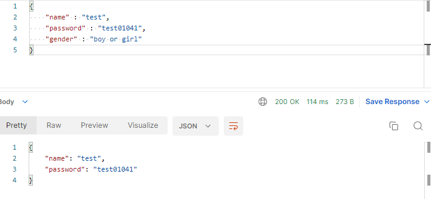

## Intro

**Keep in mind that this is not a perfect TypeScript replacement.** I didn't really feel the need for TypeScript except when checking the promised type. If there is a developer like me who is comfortable with JavaScript, if he understands the project and uses it, he will be able to receive proper help and stable typing. The above project also needs to be specified like an interface, but it is more convenient and easier to consider the configuration part in additional typescript.

## Installation

```bash
// with npm
npm i i-hate-typescript
```

## Sample Code

```js
/*
    type select default value
    string type is ""
    float, double int is 0
    boolean is true or false default you choose
*/

//example
console.log(ForceType({ a: 0.1 }, { a: 1 }));
console.log(ForceType({ a: 2 }, { a: 1 }));
console.log(ForceType({ a: "" }, { a: 1 }));
console.log(ForceType({ a: true }, { a: 1 }));

//output
// { a: 1 }
// { a: 1 }
// { a: undefined }
// { a: undefined }
```

### You can also use it usefully in your server code.

```js
const express = require("express");
const app = express();
app.use(express.json());
const { ForceType } = require("i-hate-typescript");

let spec = {
  name: "",
  password: "",
  gender: true,
};

app.post("/test", (req, res) => {
  let unmarshal = ForceType(spec, req.body);
  res.status(200).json(unmarshal);
});

app.listen(8888, () => {
  console.log("server boot");
});
```

### output

```bash
console.log(unmarshal);
//output : { name: 'test', password: 'test01041', gender: undefined }
```


